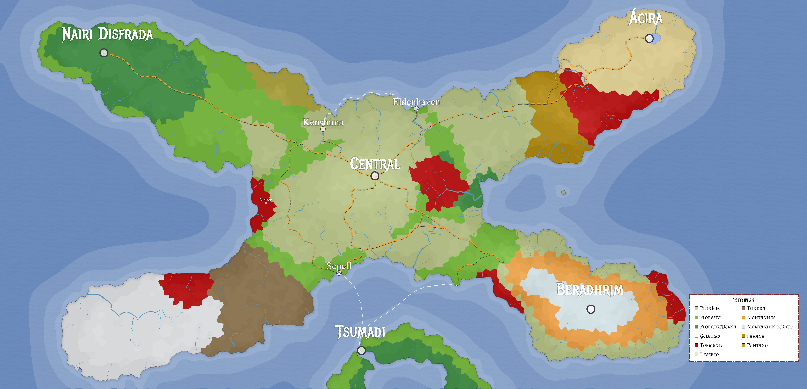
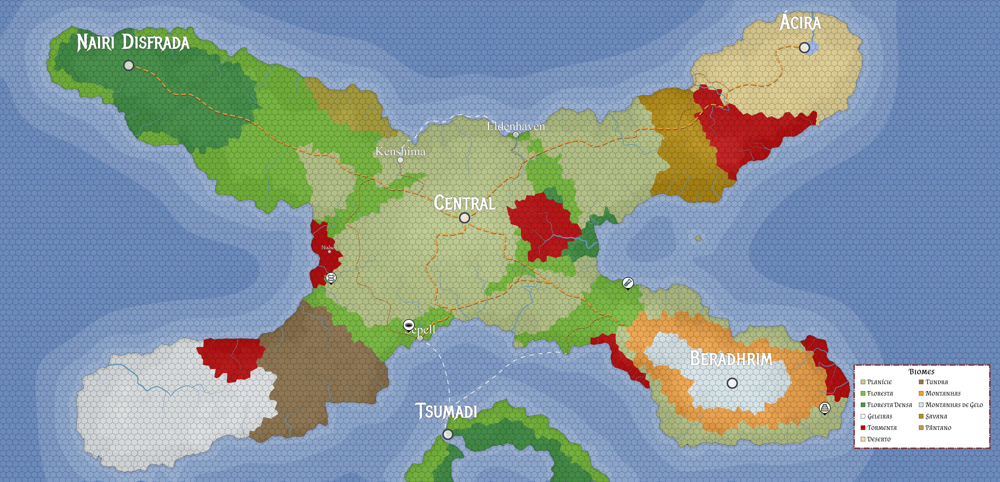

# Nyrule

Nyrule é um mundo de fantasia medieval, repleto de magia, arcanistas, guerreiros, fadas, monstros e muito mais. É inspirado em Arton, o cenário oficial de [Tormenta 20](https://site.jamboeditora.com.br/tormenta20/), mas com sua própria história e origem.

## Geo-Política

Ao centro de Nyrule temos Ampáfica, um reino majoritariamente de humanos, mas que acolhe todas as outras raças de Nyrule. Sua capital, a Central, é a maior cidade de Nyrule.

Ao noroeste temos a Floresta do Elfo, com a capital sendo Nairi Disfrada. Como o nome implica, sua população é quase que exclusivamente de elfos.

Ao sudoeste temos os Grandes Espinhos, uma enorme cadeia de montanhas. Dentro dessas montanhas está Beradhrim, um sistema de túneis e cavernas criado pelos anões.

Ao nordeste temos _[Lugar que ainda não nomeei]_, um enorme deserto. No centro desse deserto está Ácira, uma cidade de minotauros e goblins ao redor de um enorme oásis.

## Mapas

