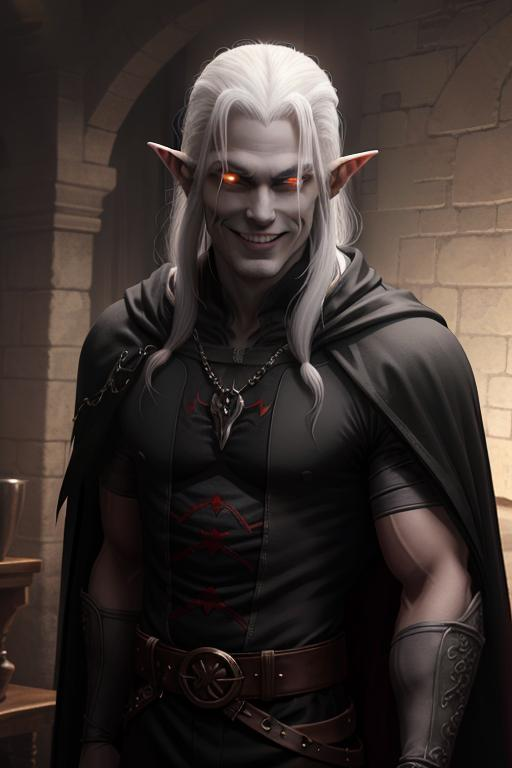

# Saevel Caiphine

## Backstory

Saevel foi um elfo cavaleiro devoto de Lin-Wu. Há 100 anos atrás, quando Malgrim tentou dominar Ampáfica com seus servos mortos-vivos, Saevel estava lá para impedir, junto de seu grupo de aventureiros. Entretanto, apenas Saevel voltou de lá com vida, seu grupo inteiro pereceu durante a luta contra Malgrim, incluindo sua esposa, Isao, uma Lefou lutadora natural de Kenshima. Saevel tentou de todas as formas revivê-la, mas há um limite para a ressurreição de pessoas. Isao já havia sido revivida anteriormente por um clérigo de Thyatis e o espaço de tempo para reviver alguém com magias comuns era muito curto.

Saevel desistiu de ser um aventureiro pouco depois de derrotar Malgrim e dedicou sua vida para encontrar formas diferentes de reviver Isao, todas sem sucesso. Saevel estava ficando velho e cansado, sabia que em algum momento não iria mais conseguir continuar sua busca. Já havia abandonado seu deus, Lin-Wu, há muito tempo. Não se preocupava mais com sua honra, seu objetivo era apenas poder reencontrar Isao. Saevel então executou um ritual que o transformara em um vampiro, assim podendo continuar sua busca incessável.

## Atualmente

Há vinte anos atrás Saevel decidiu reviver Malgrim como um morto-vivo sob seu comando. Saevel sabia que Malgrim fazia diversos estudos e experimentos sobre seres vivos e suas almas e pensou que talvez Malgrim fosse capaz de encontrar uma forma de reviver Isao. Saevel passou anos estudando e aperfeiçoando sua necromancia até ser capaz de reviver Malgrim como um zumbi a seu comando, o que conseguiu há cerca de cinco meses puxando sua alma de volta em um corpo que não era seu.

Desde então Saevel está gradualmente chegando mais perto do seu objetivo e já desconfia que Malgrim está tramando algo contra ele, mas até o momento ele não pode fazer nada sobre, afinal Malgrim ainda está seguindo suas ordens e estudando uma forma de reviver Isao.

## Aparência

Um elfo vampiro de pele acinzentada e cabelos longos e brancos usando uma roupa preta com capa. Sua aparência voltou a ser jovial quando se tornou um vampiro.

