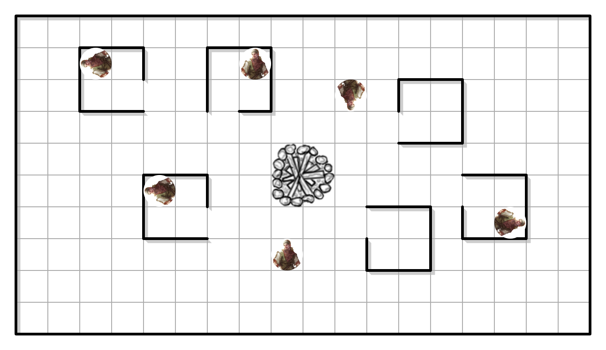

# Sessão 02.2
Última sessão foi um sucesso, essa também vai ser e vai ser mais legal ainda.

Pra essa sessão eu tô pensando em como eles vão conseguir o dinheiro, e minha ideia inicial é eles se infiltrarem na casa de algum rico não tão rico (quem sabe até na mansão dos Plenaflorum?), mas pensando bem é muito provável que eles queiram roubar a coleção do Bagdri então a Ostfer vai ter que se virar pra fazer eles mudarem de ideia.

Sessão passada foi bem mais interpretativa e sem muita advocacia de regras, essa sessão eu quero pegar mais pesado com eles com regras e eu quero um combate >:)

## Objetivos da sessão
1. Deixar eles na porta ou dentro das [ruínas do castelo do Malgrim](../Lugares/Plano_Material/Nyrule/Ermos/Marcadores/Gruta_de_Sequestradores.md);
1. Fazer a Amna rolar pelo menos uns dois testes de lembranças (Sabedoria CD 10) pra ela ver que a história dela tem a ver com o que ela está fazendo agora;
1. Introduzir as mecânicas de combate.

## Notas adicionais
1. Eles acabaram de subir para o nível 2;
1. A aventura inicia com eles voltando para acampar pela noite e amanhã ir em busca da Ostfer;
1. Como a aventura anterior não teve combate eles acabaram por não ganhar dinheiro nenhum, então essa sessão precisa ter uma quantidade boa de dinheiro ou tesouros pra eles conseguirem.

## Planejamento
Ao chegar no seu acampamento para dormir, Ostfer irá aparecer flutuando de cabeça para baixo (porque por que não?) e os parabenizará por terem conseguido um ótimo cristal e irá pedir pra ver os cristais. Ao tocar em um deles de curiosidade irá causar um breve clarão de luz vermelha. Então o cristal ficará cinza e deixará de se mover. Pelos próximos dias eles sentirão um desconforto similar ao desconforto ao segurar o Cristal de Tormenta, porém em todo o corpo e em grau bem menor. O desconforto varia a cada dia, mas num geral vai aumentando um pouco até eles chegarem nas [ruínas do castelo](../Lugares/Plano_Material/Nyrule/Ermos/Marcadores/Castelo_do_Malgrim.md), onde o desconforto some imediatamente e sem explicação.

Depois disso ela falará com eles sobre a questão do dinheiro para o joalheiro. Ela vai dar a opção de assaltarem um acampamento de bandidos, que é um dos postos avançados do bando de Oxford.

Essa sessão não tem muito o que fazer além de improvisar. Já que eu não sei bem o que eles vão fazer a melhor preparação que posso fazer é preparar o acampamento do Oxford.

O joalheiro custará T$ 200 e depois de alguns dias eles podem ir para as [ruínas do castelo](../Lugares/Plano_Material/Nyrule/Ermos/Marcadores/Castelo_do_Malgrim.md).

### Tesouros do acampamento

Para cada cabana que eles investigarem eles ganham as seguintes recompensas:

| Cabana | T$      | Itens              |
| ------ | ------- | ------------------ |
| 1ª     | T$ 140  | —                  |
| 2ª     | T$ 200  | Quadro (T$ 140)    |
| 3ª     | T$ 160  | —                  |
| 4ª     | T$ 110  | —                  |
| 5ª     | T$ 160  | Quadro (T$ 500)    |
| 6ª     | T$ 490  | —                  |
| Total  | T$ 1260 | 2 Quadros (T$ 640) |

<!-- Na 4ª cabana eles ganharam T$ 30 + 1 espada curta, mas eu converti o valor da espada em tibares sem duplicar -->

<!-- Na 6ª cabana eles ganharam T$ 120 + 1 pistola, mas eu converti o valor da pistola em tibares sem duplicar -->

Ao pegar um quadro, Amna pode fazer um teste de lembrança (Sabedoria CD 10) para tentar lembrar que esses quadros foram pintados por ela mesma.

- O primeiro quadro é um pequeno retrato (0 espaços) de Lilie Plenaflorum, a filha mais nova da família Plenaflorum. Se passar no teste, Amna sabe quem é a modelo e sabe que o quadro é obra sua.
- O segundo é um quadro um pouco maior (1/2 espaço) e retrata uma linda paisagem de um penhasco gramado com uma grande árvore cheia de flores brancas. Ao fundo do penhasco está o mar. Se passar no teste, Amna sabe que o quadro foi pintado por ela e que foi pintado próximo à cidade de Paaradiz.

## Anexo

### Ficha de Ameaça - Bandido Ligeiro (ND 1/2)
Humanoide (humano) médio

| PV  | Defesa | Deslocamento |
| --- | ------ | ------------ |
| 9   | 15     | 9m (6q)      |

Fortitude +3; Reflexos +5; Vontade +0.

#### Atributos e Perícias

  

  | Atributo     | Valor |
  | ------------ | ----- |
  | Força        | 1     |
  | Destreza     | 2     |
  | Constituição | 1     |
  | Inteligência | 0     |
  | Sabedoria    | -1    |
  | Carisma      | 0     |
  

  

  | Perícias    | Bônus      |
  | ----------- | ---------- |
  | Furtividade | +6         |
  | Iniciativa  | +4         |
  | Percepção   | +4         |
  | Outros      | + Atributo |
  

#### Ataques
* **Corpo a corpo:** Clava +9 (1d6 + 5)
* **À distância:** Funda +9 (1d6 + 1)

#### Tesouro e Equipamento
* **Equipamento:** Clava, funda e pedras x20.
* **Tesouro:** Metade.
