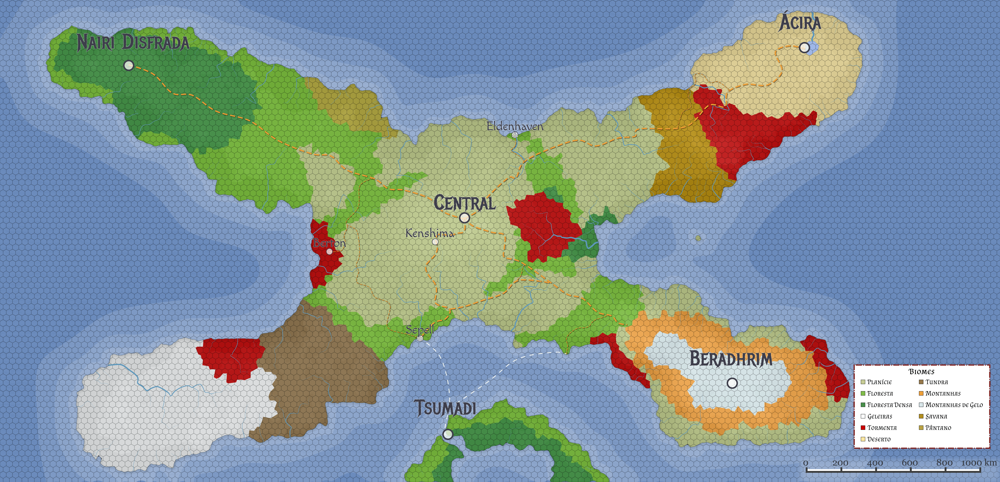
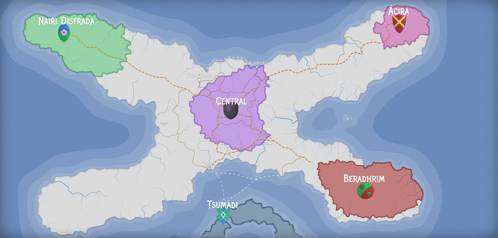

# Nyrule 3

Essa documentação é onde eu, [Nii Miyo](https://github.com/NiiMiyo), organizo minhas anotações sobre o mundo do meu RPG, [Nyrule](Lugares/Nyrule.md), mestrado no sistema de [Tormenta 20](https://site.jamboeditora.com.br/tormenta20/). Conforme o jogo vai se desenrolando e eu vou preparando mais coisas a documentação aqui vai aumentando.

## **Aviso para os jogadores**

Esse repositório é público porque o GitHub Pages só funciona de graça em repositórios públicos. Então se você joga o RPG comigo essa página é a única que eu posso garantir que não tem spoilers. **Cuidado ao acessar qualquer outra página.**

## O Mundo de [Nyrule](Lugares/Nyrule.md)

